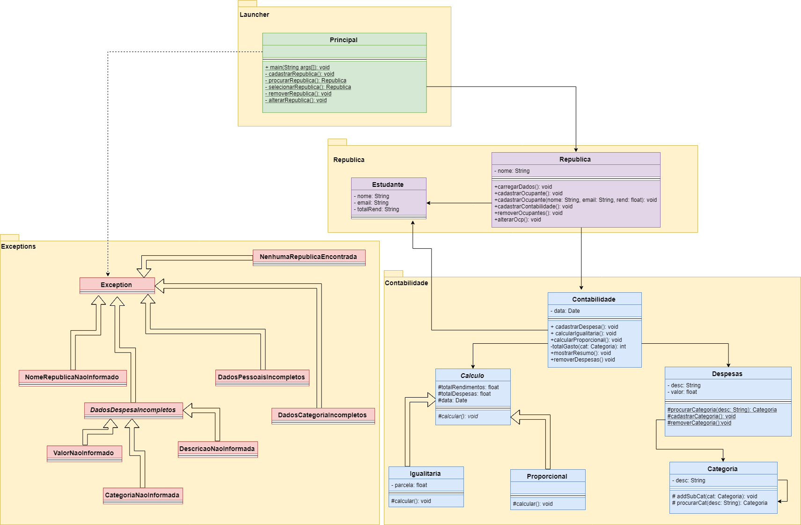

Projeto em JAVA para disciplina de Orientação a Objetos 01/2018 que consiste em montar um sistema que cuida da contabilidade de uma república universitária, contendo funcionalidades como:
* Cadastrar República
* Cadastrar ocupantes da repúblca
* Cadastrar Despesas 
* Cadastrar entradas de recurso
* Carregar dados a partir de arquivo externo 
* Mostrar resumos de gasto
* Calcular divisão de despesas por divisão igualitaria 
* Calcular divisão de despesas por divisão proporcional aos gastos

